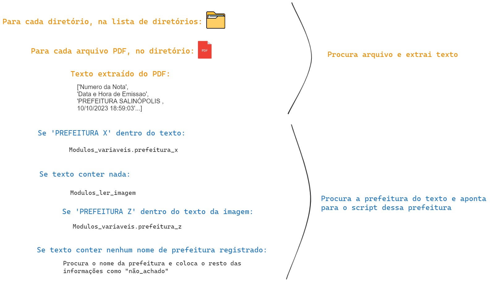

# Nota Fácil

## O que é?
É um algoritmo estrutrado em liguagem Python, cujo objetivo é ler arquivos de notas fiscais (em pdf), extrair as informações principais do documento, como número da nota, valor líquido, data de emissão, CNPJ e Razão Social do prestador e do tomador de serviço, a fim de exportar todo o compilado das notas em forma de uma planilha no Excel.

## Ambiente
Usar Anaconda
Primeiramente, é preciso configurar o ambiente Python para conseguir executar o algoritmo. Como o scrtipt possui a funcionalidade de ler arquivos de extensão pdf, mas que não possuem texto selecionável, é necessária a instalação de dois pacotes: Tesseract e Poopler.


## Estrutra do algortimo
O algoritmo é composto por 6 arquivos em Python, de forma modularizada:

    leitura_NF.py

    modulos_vairaveis.py

    modulos_prefeituras.py

    modulos_renomeia.py

    modulos_empresas.py

    modulos_ler_imagem.py


### 1.0 Arquivo "leitura_NF.py"
Esse é o algoritmo que será executado para o processo de leitura rodar.

Primeiramente, preparo ambiente para a exportação dos dados das notas. Assim, crio um DataFrame para alocar todas as variáveis escolhidas das notas, e algumas colunas de metadados.

```py
df = pd.DataFrame(columns=['Numero NF', 'Data Emissao', 'Valor Bruto', 'CNPJ Prestador', 'CNPJ Tomador', 'Razao Social Prestador','Razao Social Tomador', 'Prefeitura', 'Script','Caminho', 'Caminho Curto', 'Arquivo'])
```

!!! example ""

    - **Numero NF**: número da nota fiscal
    - **Data Emissao**: data (ou data e hora) em que a nota foi emitida
    - **Valor Bruto**: valor bruto da nota fiscal (sem descontos)
    - **CNPJ Prestador**: número do CNPJ do colaborador
    - **CNPJ Tomadorr**: número do CNPJ da empresa GAV
    - **Razao Social Prestador**: razão social do colaborador
    - **Razao Social Tomador**: razão social da empresa GAV
    - **Prefeitura**: local de prestação do serviço (ou prefeitura da nota emitida)
    - **Script**: nome da função no código que a nota foi executada
    - **Caminho**: caminho original de onde vem a nota
    - **Caminho Curto**: últimas 3 pastas do caminho original
    - **Arquivo**: nome do arquivo


#### 1.1 Entrada e saída de dados
Há duas forma de definir o input e output dos arquivos nesse código:

* Em formato de variável, importando as variáveis de caminho de entrada e saída de um arquivo .env. Assim, também crio uma lista com os diretórios de input.
```py 
d1 = os.getenv('CAMINHO_NF')
d2 = os.getenv('CAMINHO_NF_TLK')
tabela_resposta = os.getenv('CAMINHO_RESULTADO')
lista_diretorios = [d1,d2]
```
!!! example ""

    - **os.getenv**: recupera a variável do arquivo env
    - **tabela_resposta**: contém o caminho de onde colocar o dataframe produzido no código
    - **lista_diretorios**: lista que guarda os caminhos das notas

* Definindo no próprio código diretamente
```py
d1 = r'C:\Users\usuario.nome\Pasta1\Pasta2\Notas_Comissoes\Notas-Salas'
d2 = r'C:\Users\usuario.nome\Pasta1\Pasta2\Notas_Comissoes\Notas-Promo-Tlmk'
tabela_resposta = r'C:\Users\usuario.nome\Pasta1\Pasta2\Notas_Comissoes\Resultado\Leitura.xlsx'
lista_diretorios = [d1,d2]
```

A diferença entre as duas, é que a primeira torna o código mais limpo e organizado.


#### 1.2 Contagem de arquivos
Após estabelecer os diretórios, navego por cada pasta e contabilizo a quantidade total de arquivos presentes. Isso é feito com o propósito de criar um monitoramento que apresenta a porcentagem de notas lidas em relação ao total previamente definido. Esse acompanhamento visa proporcionar uma visão clara do progresso na leitura das notas em relação à meta estabelecida.

```py
qtd_arquivos = 0
for i in lista_diretorios:
    for diretorio_atual, subdiretorios, arquivos in os.walk(lista_diretorios[lista_diretorios.index(i)]):
            for arquivo in arquivos:
                qtd_arquivos += 1
```


#### 1.3 Criação do Loop
Estabeleço um loop que percorre cada diretório da lista de diretórios, adentrando em cada pasta de cada diretório e examinando, posteriormente, cada arquivo contido em cada pasta. Durante esse processo, verifica-se se o arquivo possui a extensão .pdf. Caso positivo, são definidas duas variáveis essenciais: o caminho completo do arquivo (caminho) e o caminho relativo em relação ao diretório principal (caminho curto). Por fim, o script imprime o caminho completo do arquivo em questão.

``` py
posicao = 0

for item in lista_diretorios:
    diretorio_inicial = lista_diretorios[posicao]
    posicao += 1
    for diretorio_atual, subdiretorios, arquivos in os.walk(diretorio_inicial):
        for arquivo in arquivos:
            try:
                if arquivo.lower().endswith('.pdf'): # Se é da extensão .pdf
                    caminho = diretorio_atual + '\\' + arquivo
                    caminho_curto = caminho.split('\\')[-4:-1]
                    caminho_curto = (caminho_curto[0] + '/' + caminho_curto[1] + '/' + caminho_curto[2]) 
                    print('CAMINHO DA NOTA =', caminho)
                    
```

!!! example ""

    - **caminho**: caminho de localização do arquivo
    - **caminho_curto**: as três últimas pastas do caminho


##### 1.4 Leitura da Nota
Após essa etapa, invoco a função responsável pela leitura da nota "le_contrato" (esclarecida posteriormente), armazenando o resultado na variável "texto". Em seguida, o conteúdo passa por um processo de limpeza de espaçamentos e é armazenado na variável "texto_lista". Posteriormente, são removidos os valores vazios, transformando a variável em "texto_limpo". 

Dessa forma, temos agora a variável fundamental para todo o código, que contém o texto totalmente tratado e pronto para ser utilizado nas próximas etapas.


```py
# Executa função de ler o pdf
modulos_variaveis_v13.le_contrato(caminho)

# Armazena o texto
texto = modulos_variaveis_v13.output_string.getvalue()

# Tira os espaçamentos
texto_lista = texto.split('\n')
```
!!! example ""

    - **caminho**: caminho de localização do arquivo
    - **caminho_curto**: as três últimas pastas do caminho


##### 1.5 Condicionais das prefeituras

Após a extração do texto da nota, a variável "texto_limpo" é submetida a várias condicionais com o objetivo de determinar a qual prefeitura ela se relaciona. Uma vez identificada a prefeitura específica, o script executa o processo de captura das variáveis pertinentes utilizando o módulo de variáveis, cujo funcionamento será detalhado posteriormente. 

Esse conjunto de condicionais visa direcionar o fluxo do programa para a execução das etapas específicas associadas a cada prefeitura, garantindo uma abordagem personalizada e eficiente para cada caso.

```py
# PREFEITURA DE NATAL
elif any('Prefeitura Municipal do Natal' in item for item in texto_limpo):
    modulos_variaveis.script_natal(texto_limpo, caminho, caminho_curto, arquivo, df)

# PREFEITURA DE MANAUS
elif any('PREFEITURA DE MANAUS' in item for item in texto_limpo):
    modulos_variaveis.script_manaus(texto_limpo, caminho, caminho_curto, arquivo, df)

# PREFEITURA DE RIO BRANCO
elif any('Prefeitura do Município de Rio Branco' in item for item in texto_limpo):
    modulos_variaveis.script_rio_branco(texto_limpo, caminho, caminho_curto, arquivo, df)
```

!!! example "**Atenção!**"

    - **modulos_variaveis**: módulo que contém o direcionamento de cada prefeitura específica
    - **modulos_variaveis.script_natal**: função que direciona a execução da função específica da prefeitura natal, contida no módulo variáveis

##### 1.6 PDF com imagem
Após passar por todas as condicionais de processamento dos textos relacionadas às prefeituras, o código realiza uma verificação final. Ele avalia se a variável "texto_limpo" contém os caracteres '\x0c' ou '\n0'. Se essa condição for satisfeita, indica que o texto é proveniente de uma nota em PDF não selecionável, como uma imagem de um print.

```py
elif texto == '\x0c' \
or '\x0c' in texto \
or '\n0' in texto :
```


Nesse cenário, ao atender a essa condição, o código executa um processo para extrair os dados dessa imagem (explicado no tópico "módulo ler imagem"), e aloca o resultado na variável "texto_imagem".
Assim, "texto imagem" que recebeu uma lista com o resultado da leitura da nota em imagem, passa por um processo de limpeza, eliminando caracteres vazios e linhas nulas.

```py
script = 'imagem'

# Executa scritp de leitra de imagem
texto_imagem = modulos_ler_imagem.get_text_from_any_pdf(caminho)
texto_imagem = texto_imagem.split('\n')
texto_imagem = [item.strip() for item in texto_imagem if item.strip() != '']
```

!!! example ""

    - **caminho**: caminho de localização do arquivo, que a função utiliza para fazer a leitura dessa nota específica

A partir deste ponto, o código continua a percorrer as condições subsequentes, verificando se o conteúdo se encaixa em alguma prefeitura específica.

```py
# PREFEITURA DE UBERABA IMAGEM
elif any('PREFEITURA MUNICIPAL DE UBERABA' in item for item in texto_imagem):
    modulos_variaveis.script_uberaba_imagem(texto_imagem, caminho, caminho_curto, arquivo, df)

# PREFEITURA DE BELÉM IMAGEM
elif any('PREFEITURA MUNICIPAL DE BELEM' in item for item in texto_imagem):
    modulos_variaveis.script_belem_imagem(texto_imagem, caminho, caminho_curto, arquivo, df)

# PREFEITURA DE ANANINDEUA IMAGEM
elif any('PREFEITURA MUNICIPAL DE ANANINDEUA' in item for item in texto_imagem):
    modulos_variaveis.script_ananindeua_imagem(texto_imagem, caminho, caminho_curto, arquivo, df)
```

!!! example ""

    - **modulos_variaveis**: módulo que contém o direcionamento de cada prefeitura específica
    - **modulos_variaveis.script_uberaba_imagem**: função que direciona a execução da função específica da prefeitura de uberaba (em formato de imagem), contida no módulo variáveis


!!! tip "Nota"
    Por que algumas notas são em formato de PDF normal e outras em formato PDF com imagem?
    A variação no formato das notas em PDF ocorre devido ao processo descentralizado de geração, onde cada colaborador é responsável pela emissão de suas próprias notas. Durante esse processo, algumas notas são geradas de maneira não padrão, resultando em PDFs com texto não selecionável. 


##### 1.7 Prefeitura não existente
Após percorrer todas as condições relacionadas aos casos de texto e imagem, e não encontrar uma correspondência em nenhuma delas, a variável é redirecionada para a cláusula "else". Nesse ponto, o código tenta, pelo menos, extrair o nome da prefeitura associada ao novo caso.Se bem-sucedido, o nome da prefeitura é extraído, e as outras variáveis são configuradas como brancas. Em seguida, todas as variáveis são adicionadas a uma lista, que é inserida no dataframe.

No caso de não ser possível extrair o nome da prefeitura, a variável fica com o valor "nao_achado", e, juntamente com as outras variáveis em branco, uma lista é criada e inserida como uma nova linha no dataframe. Nesse caso, a variável script, que contém qual script da variável modulo_variaveis foi ativado, fica com o valor "sem_codigo". 

Essa abordagem permite lidar de maneira flexível com situações não previamente mapeadas, buscando ao menos identificar o nome da prefeitura mesmo quando a estrutura do documento não segue os padrões conhecidos.

```py
else:
for indice, item in enumerate(texto_imagem):
    if 'prefeitura' in item.lower() or 'município' in item.lower():
        prefeitura = texto_imagem[indice]
        break
    else:
        prefeitura = 'nao_achado'

num_nf = ''
data_emissao = ''
vlr_liquido = '' 
cnpj_prestador = ''
cnpj_tomador = ''
razao_prestador = ''
razao_tomador = ''
script = 'sem_codigo'

lista_variaveis = [num_nf,data_emissao, vlr_liquido, 
                cnpj_prestador, cnpj_tomador, 
                razao_prestador, razao_tomador, 
                prefeitura, script, caminho, caminho_curto, arquivo]

# Inserção da lista no DataFrame
df.loc[len(df)] = lista_variaveis
```
!!! example ""

    - **df**: datafrane que está sendo construído durante o código


Agora com a variável "texto_limpo", há 3 possibilidades:
!!! example ""
    - **1**) Se o nome da "prefeitura X" estiver no texto_limpo, então será executado o script da prefeitura X.
    - **2**) Se o texto_limpo conter nenhuma palavra, ou seja, o PDF está não selecionável, como uma imagem, então vou tratar a imagem, extrair o texto da imagem e verificar se a prefeitura X está no texto, para executar o script da prefeitura correta.
    - **3**) O texto_limpo não contém nenhum nome de prefeitura que tenho registro, logo na planilha do Excel vai conter esse arquivo com a informação "não_achado".



Então para essas possibilidades o código fica da seguinte forma:

```py
elif any('Município de Uberlândia' in item for item in texto_limpo): 
    modulos_variaveis.script_uberlandia_imagem(doc_pdf, caminho2, arquivo, df)

elif texto == '\x0c' or '\x0c' in texto :
    texto_imagem = modulos_ler_imagem.get_text_from_any_pdf(doc_pdf)
    texto_imagem = texto_imagem.split('\n')
    texto_imagem = [item.strip() for item in texto_imagem if item.strip() != '']

    elif any('PREFEITURA MUNICIPAL DE BELEM' in item for item in texto_imagem):
        modulos_variaveis.script_belem_imagem(texto_imagem, doc_pdf, caminho2, arquivo, df)

```


## Tema 2

### Tema 3