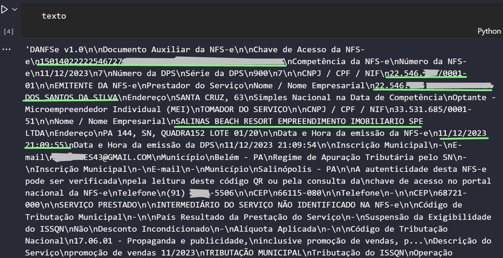

# Nota Fácil

## O que é?
Trata-se de um algoritmo desenvolvido em Python, meticulosamente estruturado para processar arquivos de notas fiscais em formato PDF. O seu propósito é extrair as informações cruciais desses documentos, tais como número da nota, valor líquido, data de emissão, CNPJ e Razão Social tanto do prestador quanto do tomador de serviço. O resultado desse processo é então exportado e organizado em uma planilha do Excel, proporcionando um compilado abrangente e organizado das notas fiscais processadas.

&nbsp;

## Ambiente
Para garantir o funcionamento adequado do algoritmo, é recomendável utilizar o Python fornecido pelo Anaconda. Além disso, é necessário configurar a instalação de dois pacotes essenciais: Tesseract e Poopler para a leitura de imagens, conforme explicado detalhadamente no tópico 2.0. Essa configuração é crucial para garantir a eficiência e precisão do algoritmo, permitindo uma leitura eficaz das notas fiscais em formato PDF.

&nbsp;

## Estrutra do algortimo
O algoritmo é composto por 6 arquivos em Python, de forma modularizada:

    leitura_NF.py

    modulos_vairaveis.py

    modulos_prefeituras.py

    modulos_renomeia.py

    modulos_empresas.py

    modulos_ler_imagem.py

&nbsp;
___

## 1.0 Arquivo "leitura_NF.py"
Esse é o algoritmo que será executado para o processo de leitura rodar.

Primeiramente, prepara-se o ambiente para a exportação dos dados das notas, criando um DataFrame para alocar todas as variáveis escolhidas das notas, e algumas colunas de metadados.

```py
df = pd.DataFrame(columns=['Numero NF', 'Data Emissao', 'Valor Bruto', 'CNPJ Prestador', 'CNPJ Tomador', 'Razao Social Prestador','Razao Social Tomador', 'Prefeitura', 'Script','Caminho', 'Caminho Curto', 'Arquivo'])
```

!!! example ""
    - **Numero NF**: número da nota fiscal
    - **Data Emissao**: data (ou data e hora) em que a nota foi emitida
    - **Valor Bruto**: valor bruto da nota fiscal (sem descontos)
    - **CNPJ Prestador**: número do CNPJ do colaborador
    - **CNPJ Tomadorr**: número do CNPJ da empresa GAV
    - **Razao Social Prestador**: razão social do colaborador
    - **Razao Social Tomador**: razão social da empresa GAV
    - **Prefeitura**: local de prestação do serviço (ou prefeitura da nota emitida)
    - **Script**: nome da função no código que a nota foi executada
    - **Caminho**: caminho original de onde vem a nota
    - **Caminho Curto**: últimas 3 pastas do caminho original
    - **Arquivo**: nome do arquivo

&nbsp;
___

#### 1.1 Entrada e saída de dados
Há duas forma de definir o input e output dos arquivos nesse código:

* Em formato de variável, importando as variáveis de caminho de entrada e saída de um arquivo .env e alocando-as em uma lista com os diretórios de input.
```py 
d1 = os.getenv('CAMINHO_NF')
d2 = os.getenv('CAMINHO_NF_TLK')
tabela_resposta = os.getenv('CAMINHO_RESULTADO')
lista_diretorios = [d1,d2]
```
!!! example ""
    - **os.getenv**: recupera a variável do arquivo env
    - **tabela_resposta**: contém o caminho de exportação do dataframe produzido no código
    - **lista_diretorios**: lista que guarda os caminhos das notas

* Definindo no próprio código diretamente
```py
d1 = r'C:\Users\usuario.nome\Pasta1\Pasta2\Notas_Comissoes\Notas-Salas'
d2 = r'C:\Users\usuario.nome\Pasta1\Pasta2\Notas_Comissoes\Notas-Promo-Tlmk'
tabela_resposta = r'C:\Users\usuario.nome\Pasta1\Pasta2\Notas_Comissoes\Resultado\Leitura.xlsx'
lista_diretorios = [d1,d2]
```

A diferença é que a primeira torna o código mais limpo e organizado.

&nbsp;
___

#### 1.2 Contagem de arquivos
Após estabelecer os diretórios, o algoritmo navega por cada pasta e contabilizo a quantidade total de arquivos presentes. Isso é feito com o propósito de criar um monitoramento que apresenta a porcentagem de notas lidas em relação ao total previamente definido. Esse acompanhamento visa proporcionar uma visão clara do progresso na leitura das notas em relação à meta estabelecida.

```py
qtd_arquivos = 0
for i in lista_diretorios:
    for diretorio_atual, subdiretorios, arquivos in os.walk(lista_diretorios[lista_diretorios.index(i)]):
            for arquivo in arquivos:
                qtd_arquivos += 1
```
&nbsp;
___

#### 1.3 Criação do Loop
O loop estabelecido percorre cada diretório da lista de diretórios, adentrando em cada pasta e examinando, posteriormente, cada arquivo. Durante esse processo, verifica se o arquivo possui a extensão .pdf. Caso positivo, são definidas duas variáveis essenciais: o caminho completo do arquivo (caminho) e o caminho relativo em relação ao diretório principal (caminho curto). Por fim, o script imprime o caminho completo do arquivo em questão.

``` py
posicao = 0

for item in lista_diretorios:
    diretorio_inicial = lista_diretorios[posicao]
    posicao += 1
    for diretorio_atual, subdiretorios, arquivos in os.walk(diretorio_inicial):
        for arquivo in arquivos:
            try:
                if arquivo.lower().endswith('.pdf'): # Se é da extensão .pdf
                    caminho = diretorio_atual + '\\' + arquivo
                    caminho_curto = caminho.split('\\')[-4:-1]
                    caminho_curto = (caminho_curto[0] + '/' + caminho_curto[1] + '/' + caminho_curto[2]) 
                    print('CAMINHO DA NOTA =', caminho)
                    
```

!!! example ""
    - **caminho**: caminho de localização do arquivo
    - **caminho_curto**: as três últimas pastas do caminho

&nbsp;
___

##### 1.3.1 Leitura da Nota
Após essa etapa, chama-se a função `le_contrato` responsável pela leitura da nota (esclarecida no tópico 3.0), armazenando o resultado na variável "texto". Em seguida, o conteúdo passa por um processo de remoção do caracter "\n0" e é armazenado na variável "texto_lista". Posteriormente, são removidos os valores vazios, transformando a variável em "texto_limpo". 

Dessa forma, temos agora a variável fundamental para todo o código, que contém o texto totalmente tratado e pronto para ser utilizado nas próximas etapas.


```py
# Executa função de ler o pdf
modulos_variaveis_v13.le_contrato(caminho)

# Armazena o texto
texto = modulos_variaveis_v13.output_string.getvalue()

# Tira os espaçamentos
texto_lista = texto.split('\n')
```
!!! example ""
    - **caminho**: caminho de localização do arquivo
    - **caminho_curto**: as três últimas pastas do caminho



&nbsp;


&nbsp;
___

##### 1.3.2 Direcionamento de prefeitura

Após a extração do texto da nota, a variável "texto_limpo" é submetida a várias condicionais com o objetivo de determinar a qual prefeitura ela se relaciona. Uma vez identificada a prefeitura específica, o script executa o processo de captura das variáveis pertinentes utilizando o "modulos_prefeitura". 

Esse conjunto de condicionais visa direcionar o fluxo do programa para a execução das etapas específicas associadas a cada prefeitura, garantindo uma abordagem personalizada e eficiente para cada caso.

```py
# PREFEITURA DE NATAL
elif any('Prefeitura Municipal do Natal' in item for item in texto_limpo):
    modulos_prefeitura.pref_natal(texto_limpo, caminho, caminho_curto, arquivo, df)

# PREFEITURA DE MANAUS
elif any('PREFEITURA DE MANAUS' in item for item in texto_limpo):
    modulos_prefeitura.pref_manaus(texto_limpo, caminho, caminho_curto, arquivo, df)

# PREFEITURA DE RIO BRANCO
elif any('Prefeitura do Município de Rio Branco' in item for item in texto_limpo):
    modulos_prefeitura.pref_rio_branco(texto_limpo, caminho, caminho_curto, arquivo, df)
```

!!! example ""
    - **modulos_prefeitura**: módulo que contém o direcionamento de cada prefeitura específica

&nbsp;
___

##### 1.3.3 PDF com imagem
Após passar por todas as condicionais de processamento dos textos relacionadas às prefeituras, o código realiza uma verificação final. Ele avalia se a variável "texto" contém os caracteres '\x0c' ou '\n0'. Se essa condição for satisfeita, indica que o texto é proveniente de uma nota em PDF não selecionável, como uma imagem de um print.

```py
elif texto == '\x0c' \
or '\x0c' in texto \
or '\n0' in texto :
```


Nesse cenário, ao atender a essa condição, o código executa um processo para extrair os dados dessa imagem (explicado no tópico "modulo_ler_imagem"), e aloca o resultado na variável "texto_imagem".
Assim, "texto imagem" que recebeu uma lista com o resultado da leitura da nota em imagem, passa por um processo de limpeza, eliminando caracteres vazios e linhas nulas.

```py
script = 'imagem'

# Executa scritp de leitra de imagem
texto_imagem = modulos_ler_imagem.get_text_from_any_pdf(caminho)
texto_imagem = texto_imagem.split('\n')
texto_imagem = [item.strip() for item in texto_imagem if item.strip() != '']
```

!!! example ""
    - **caminho**: caminho de localização do arquivo

A partir deste ponto, o código continua a percorrer as condições subsequentes, verificando se o conteúdo se encaixa em alguma prefeitura específica.

```py
# PREFEITURA DE UBERABA IMAGEM
elif any('PREFEITURA MUNICIPAL DE UBERABA' in item for item in texto_imagem):
    modulos_prefeitura.pref_uberaba_imagem(texto_imagem, caminho, caminho_curto, arquivo, df)

# PREFEITURA DE BELÉM IMAGEM
elif any('PREFEITURA MUNICIPAL DE BELEM' in item for item in texto_imagem):
    modulos_prefeitura.pref_belem_imagem(texto_imagem, caminho, caminho_curto, arquivo, df)

# PREFEITURA DE ANANINDEUA IMAGEM
elif any('PREFEITURA MUNICIPAL DE ANANINDEUA' in item for item in texto_imagem):
    modulos_prefeitura.pref_ananindeua_imagem(texto_imagem, caminho, caminho_curto, arquivo, df)
```

!!! example ""

    - **modulos_prefeitura**: módulo que contém o direcionamento de cada prefeitura específica


!!! tip "Nota"
    Por que algumas notas são em formato de PDF normal e outras em formato PDF com imagem?
    A variação no formato das notas em PDF ocorre devido ao processo descentralizado de geração, onde cada colaborador é responsável pela emissão de suas próprias notas. Durante esse processo, algumas notas são geradas de maneira não padrão, resultando em PDFs com texto não selecionável. 

&nbsp;
___

##### 1.3.4 Prefeitura não existente
Após percorrer todas as condições relacionadas aos casos de texto e imagem, e não encontrar uma correspondência em nenhuma delas, a variável é redirecionada para a cláusula "else". Nesse ponto, o código tenta, pelo menos, extrair o nome da prefeitura associada ao novo caso. Se bem-sucedido, o nome da prefeitura é extraído, e as outras variáveis são configuradas como brancas. Em seguida, todas as variáveis são adicionadas a uma lista, que é inserida no dataframe.

No caso de não ser possível extrair o nome da prefeitura, as variáveis ficam com o valor "nao_localizado", e, são inseridas como uma nova linha no dataframe.

Essa abordagem permite lidar de maneira flexível com situações não previamente mapeadas, buscando ao menos identificar o nome da prefeitura mesmo quando a estrutura do documento não segue os padrões conhecidos.

```py
else:
    for indice, item in enumerate(texto_imagem):
        if 'prefeitura' in item.lower() or 'município' in item.lower():
            prefeitura = texto_imagem[indice]
            break
        else:
            prefeitura = 'nao_localizado'

    num_nf = 'nao_localizado'
    data_emissao = 'nao_localizado'
    vlr_liquido = 'nao_localizado' 
    cnpj_prestador = 'nao_localizado'
    cnpj_tomador = 'nao_localizado'
    razao_prestador = 'nao_localizado'
    razao_tomador = 'nao_localizado'
    script = 'nao_localizado'

    lista_variaveis = [num_nf,data_emissao, vlr_liquido, 
                    cnpj_prestador, cnpj_tomador, 
                    razao_prestador, razao_tomador, 
                    prefeitura, script, caminho, caminho_curto, arquivo]

    # Inserção da lista no DataFrame
    df.loc[len(df)] = lista_variaveis
    
```
!!! example ""
    - **df**: datafrane que está sendo construído durante o código

&nbsp;
___

#### 1.4 Tentativa e Erro
Todo esse código de loop, passa por um processo de tentativa e erro, utilizando o "try except". Dessa forma, mesmo que ocorra algum erro durante a execução, o algoritmo não irá travar. Nesse sentido, ele simplesmente irá entender aquela nota como erro, preencher a lista_variaveis com a palavra "erro" nas variáveis, e inseri-la no dataframe.

```py
try:
    if arquivo.lower().endswith('.pdf'): # Se é da extensão .pdf
        caminho = diretorio_atual + '\\' + arquivo
        caminho_curto = caminho.split('\\')[-4:-1]
        caminho_curto = (caminho_curto[0] + '/' + caminho_curto[1] + '/' + caminho_curto[2]) 
        print('CAMINHO DA NOTA =', caminho)

        ...

except Exception as e:
    lista_variaveis = ['erro', 'erro', 'erro', 'erro', 'erro', 'erro', 'erro', 'erro', e, caminho, caminho_curto, arquivo]
    df.loc[len(df)] = lista_variaveis

```
&nbsp;
___

#### 1.5 Carregamento de leitura
Para ter um acompanhamento da leitura, o algortimo exibe no terminal algumas informações:

* O nome do arquivo (escrito no no início do loop);
* Quantidade de notas lidas;
* Quantidade e porcentagem de notas com alguma variável come erro (qualquer uma que não tiver a palavra "script" dentro da variável "script", ou seja, que não tem nenhuma função apropriada para aquela prefeitura);
* Visualização de uma barra de progresso (baseada na quantidade de notas lidas pelo total).

```py
# Calcula notas com algum tipo de erro ou não leitura
Soma_Notas_Erro = np.sum(np.logical_not(df['Script'].str.contains('script')))
Porcentagem = round((Soma_Notas_Erro / qtd_arquivos) * 100,2)

# Mostra barra de processamento
print('Quantidade NOTAS LIDAS =', len(df),'/', qtd_arquivos)
print('Quantidade NOTAS IMPERFEITAS =', Soma_Notas_Erro, '==', Porcentagem, '%')
lista_df = list(range(1,len(df)+1))

for i in tqdm(list(range(1,len(df)+1)), total=qtd_arquivos,  unit="item", bar_format="{desc}: {percentage:.2f}% {bar}",desc="Processando"):
    pass
```
!!! example ""
    - **qtd_arquivos**: quantidade total de arquivos, calculada na sessão "1.2 Contagem de arquivos"

&nbsp;
___

#### 1.6 Tratamento e Limpeza do DataFrame
Após a criação do DataFrame, realiza-se ajustes para aprimorar a qualidade dos dados. Especificamente:

* Coluna `CNPJ`:
    * Remoção de caracteres não numéricos, mantendo apenas os dígitos.
    * Correção de um CNPJ específico para evitar interpretação incorreta
* Coluna `Valor Liquido`:
    * Eliminação de caracteres não numéricos, garantindo apenas valores numéricos.
* Coluna `Data Emissao`:
    * Substituição de '-' por '/', uniformizando o formato.
    * Padronização de todas as datas para o formato dd/mm/aaaa.
* Coluna `Razao Prestador Resumo`:
    * Execução da função `extrai_maiusculas`, mantendo apenas as palavras escritas totalmente em maiúsculo .
    * Separação das palavas pelo espaço e seleção das duas primeiras posições.


```py
df['CNPJ Prestador'] = df['CNPJ Prestador'].str.replace(r'\D', '', regex=True)
df['CNPJ Prestador'] = df['CNPJ Prestador'].str.strip()

df['CNPJ Tomador'] = df['CNPJ Tomador'].str.replace(r'\D', '', regex=True)
df['CNPJ Tomador'] = df['CNPJ Tomador'].str.strip()

# Substitui a leitura errada do cnpj de GAV GRAMADO TRES
df['CNPJ Tomador'] = df['CNPJ Tomador'].str.replace('90094155000102', '50094155000102')

df['Valor Liquido'] = df['Valor Liquido'].str.replace(r'[a-zA-Z$]', '', regex=True)

df['Data Emissao'] = df['Data Emissao'].str.replace(r'-', '/', regex=True)
df['Data Emissao'] = df['Data Emissao'].str.extract(r'(\d{2}/\d{2}/\d{4})', expand = False)

df['Razao Prestador Resumo'] = df['Razao Social Prestador'].apply(modulos_variaveis.extrair_maiusculas)
df['Razao Prestador Resumo'] = df['Razao Prestador Resumo'].str.split(' ', n=2).apply(lambda x: ' '.join(x[:2]))
```
&nbsp;
___

#### 1.7 Validação do CNPJ
Para validar a consistência dos CNPJs do Tomador nas notas fiscais em relação às empresas registradas no banco de dados, realiza a extração da tabela de empresas do DW, situada no módulo empresas. Utilizando Python, efetua-se a limpeza e tratamento necessários na tabela de empresas para garantir a integridade dos dados. Em seguida, compara os CNPJs do Tomador nas notas fiscais com os CNPJs da tabela de empresas. 

Quando há correspondência, incorporam ao DataFrame das notas fiscais duas novas colunas: 'Codigo Tomador' com o código da empresa correspondente, e 'Empresa Tomador' com a razão social correspondente. Este processo tem como objetivo assegurar a conformidade dos CNPJs do Tomador com as empresas registradas, proporcionando uma análise consistente dos dados.

```py
# Conexão com tabela empresas do banco
df_empresas = modulos_empresas.df_empresas
df_empresas = df_empresas.drop_duplicates(subset='cnpj', keep='first')
df_empresas['cod_empresa'] = df_empresas['cod_empresa'].astype(int)
df_empresas['cod_empresa'] = round(df_empresas['cod_empresa'])
df_empresas['cod_empresa'] = df_empresas['cod_empresa'].astype(str)

# Especifica o codigo da empresa
df['Codigo Tomador'] = np.where(
    df['CNPJ Tomador'].isin(df_empresas['cnpj']),
    df['CNPJ Tomador'].map(df_empresas.set_index('cnpj')['cod_empresa']),
    '-'
)

# Especifica a razao social da empresa
df['Empresa Tomador'] = np.where(
    df['CNPJ Tomador'].isin(df_empresas['cnpj']),
    df['CNPJ Tomador'].map(df_empresas.set_index('cnpj')['empresa']),
    '-'
)
```

&nbsp;
___

#### 1.8 Coluna de Novos Nomes
Com o intuito de padronizar os nomes dos arquivos de acordo com o conteúdo das notas fiscais, introduz uma coluna com um formato padrão: "Razão social do prestador + código do tomador + valor do serviço da nota". A criação dessa coluna é realizada invocando a função coluna_altera_nome do módulo variáveis. 

Posteriormente, efetua uma limpeza na coluna, substituindo caracteres específicos e removendo acentos utilizando a função unidecode. Essa estratégia visa estabelecer uma identificação uniforme e descritiva para cada nota fiscal, facilitando a organização e referência dos arquivos

```py
# Cria a coluna com o nome do arquivo alterado
df['Arquivo_Nome_Alterado'] = df.apply(modulos_variaveis.coluna_altera_nome, axis=1)
df['Arquivo_Nome_Alterado'] = df['Arquivo_Nome_Alterado'].apply(modulos_variaveis_v13.limpa_acento)
df['Arquivo_Nome_Alterado'] = df['Arquivo_Nome_Alterado'].str.replace("'", '')
df['Arquivo_Nome_Alterado'] = df['Arquivo_Nome_Alterado'].str.replace("@", '')
df['Arquivo_Nome_Alterado'] = df['Arquivo_Nome_Alterado'].astype(str)
df['Arquivo_Nome_Alterado'] = df['Arquivo_Nome_Alterado'].apply(unidecode)
```
Depois, é chamada a função que renomeia o próprio arquivo, contida no modulo renomear.

```py
# Renomeia os arquivos
modulos_renomear.renomeia(df)
```

&nbsp;
___

#### 1.9 Exportação do Resultado

Durante o tratamento do dataframe já feito, utiliza-se alguns comandos de exportação dessa tabela para o Excel, com o intuito de garantir que, mesmo que o código dê algum erro no final, seja possível exportar a tabela, mesmo sem tratamento

```py
df.to_excel(r'C:\Users\usuario.nome\Pasta1\Pasta2\Resultado.xlsx', index=False)
```

Mas no fim do código, exporta-se o dataframe pelo caminho de retorno indicado no arquivo .env

```py
df.to_excel(tabela_resposta, index=False)
```

&nbsp;
___

#### 1.10 Contagem do Tempo
Por fim, é exposto no terminal o tempo total da leitura das notas.

```py
# Conta o tempo de execução
tempo_final = time.time()
tempo_total = (tempo_final - tempo_inicio)/60
print('exportado para excel')
print('Tempo total', tempo_total, 'minutos')
```


&nbsp;
___

## 2.0 Arquivo "modulos_variaveis.py"

O objetivo principal deste módulo é armazenar algumas funções de uso geral que serão utilizadas no módulo principal (leitura_NF.py).

#### 2.1 Função para leitura da nota

A função le_contrato tem como objetivo ler um contrato em formato PDF, utilizando a biblioteca PDFminer. Ela realiza a extração de texto de cada página do PDF e armazena o resultado em uma variável global chamada output_string. Essa função é útil quando se deseja processar o conteúdo textual de contratos presentes em documentos PDF.

```py
def le_contrato(caminho):
    '''Lê contrato em pdf'''
    # Variável global para armazenar o texto extraído
    global output_string
    output_string = StringIO()

    # Abre o arquivo PDF no modo de leitura binária
    with open(caminho, 'rb') as in_file:
        # Cria um objeto PDFParser para analisar o conteúdo do arquivo PDF
        parser = PDFParser(in_file)
        # Gera um objeto PDFDocument com base no parser
        doc = PDFDocument(parser)

    # Criação de objetos para gerenciar recursos e converter texto
    rsrcmgr = PDFResourceManager()
    # TextConverter converte o conteúdo do PDF em texto
    device = TextConverter(rsrcmgr, output_string, laparams=LAParams())

    # Cria um objeto PDFPageInterpreter para interpretar as páginas do PDF
    interpreter = PDFPageInterpreter(rsrcmgr, device)

    # Itera sobre cada página do documento PDF
    for page in PDFPage.create_pages(doc):
        # Processa o conteúdo de cada página, convertendo-o em texto e armazenando em output_string
        interpreter.process_page(page)
```

!!! example ""
    - **caminho**: caminho de localização do arquivo


&nbsp;
___

#### 2.2 Função alteração nome de coluna

Uma utilidade do algoritmo é criar uma coluna no dataframe com o novo nome de alteração do arquivo, um nome padronizado com 'razao social do prestador_codigo da empresa_valor da nota'.

Esta função, `coluna_altera_nome`, tem como objetivo criar uma nova coluna em um DataFrame, contendo nomes de arquivos padronizados. O novo nome é formado pela combinação de três colunas específicas do DataFrame: "Razao Social Prestador", "Codigo Tomador", e "Valor Liquido". 

No entanto, o novo nome só é gerado se os valores dessas colunas atenderem a critérios específicos, incluindo a verificação de certos valores indesejados e limites de caracteres. Se os critérios são satisfeitos, a função retorna o novo nome; caso contrário, retorna o valor original da coluna "Arquivo". Em situações excepcionais, a função pode retornar "Excedeu_Caracter" se o novo nome ultrapassar o limite de caracteres ou "Nao" em caso de exceção.

```py
def coluna_altera_nome(row):
    # Obtém os valores das colunas relevantes do DataFrame
    prestador = row['Razao Prestador Resumo']
    tomador = row['Codigo Tomador']
    valor = row['Valor Liquido']
    arquivo = row['Arquivo']
    try:
        # Verifica se os valores atendem aos critérios para a criação de um novo nome
        if (prestador is not None and prestador.strip()) and prestador not in ['erro'] and prestador != 'nao_achado' and not any(char.isdigit() for char in prestador) and \
            tomador != '-' and \
            (valor is not None and valor.strip()) and valor not in ['erro'] and valor != 'nao_achado' and valor != '_':

            # Cria um novo nome conforme o padrão estabelecido
            novo_nome = prestador + '__EMP' + tomador + '__' + str(valor) + '.pdf'

            # Verifica se o novo nome não excede o limite de 256 caracteres
            if len(novo_nome) <= 256:
                return novo_nome
            else:
                # Retorna um indicativo caso o novo nome exceda o limite de caracteres
                'Excedeu_Caracter'
        else:
            # Se os critérios não forem atendidos, retorna o valor original da coluna 'Arquivo'
            return arquivo
    except:
        # Retorna 'Nao' em caso de exceção
        return 'Nao'

```
!!! example ""
    - **row**: linha do DataFrame

&nbsp;
___

#### 2.3 Função limpa acento

Esta função, `limpa_acento`, tem como objetivo remover caracteres epeciais e acentos.

```py
def limpa_acento(texto):
    try:
        return unidecode(str(texto))
    except:
        return texto
```

!!! example ""
    - **texto**: entrada do texto que se deseja limpar

&nbsp;
___

#### 2.4 Função extrai maiúsculas

Esta função, `extrair_maiusculas`, tem como objetivo extrair do input apenas as palavras escritas com letras maiúsculas. 

```py
def extrair_maiusculas(row):
    try:
        palavras_maiusculas = re.findall(r'\b[A-Z]+\b', row)
        if palavras_maiusculas:
            return ' '.join(palavras_maiusculas)
        else:
            return row
    except:
        pass
```

&nbsp;
___

## 3.0 Arquivo "modulos_prefeituras.py"
O propósito deste arquivo é criar um script dedicado para cada prefeitura, com o objetivo de extrair informações cruciais de notas fiscais. As variáveis de interesse são:

* Número da nota
* Data de emissão
* Valor bruto
* Razão social dos prestadores e tomadores de serviço
* CNPJ dos prestadores e tomadores de serviço
* Nome da prefeitura (local de prestação do serviço)

Cada script específico para uma prefeitura é definido como uma função, onde um loop `for` é empregado para percorrer todas as linhas do texto da nota. Dentro desse loop, há a busca por palavras-chave específicas. Ao encontrar uma correspondência, o script captura o valor associado e armazena-o em uma variável. Isso permite a extração eficiente de cada variável relevante do texto da nota fiscal.

Em alguns casos, ao invés de buscar por uma palavra-chave específica como "data de emissão", o script adota a abordagem de percorrer todo o texto em busca de padrões, como "dd/mm/aaaa". Essa estratégia é aplicada de maneira semelhante para a identificação de CNPJ.

É importante ressaltar que tanto notas no formato de imagem quanto em PDF possuem funções específicas para cada prefeitura, e estas fornecem a variável que armazena o texto da nota como entrada para a função.

As variáveis extraídas, contendo as informações relevantes, são consolidadas em uma lista. Essa lista é criada no módulo_variaveis, conforme detalhado no tópico 2.0, e posteriormente é utilizada para alimentar um dataframe. Essa abordagem possibilita a organização e estruturação eficiente das informações extraídas das notas fiscais.


Há 3 tipos de arquivo de nota fiscal que requerem funções específicas:

### Tipo 1: Arquivo PDF com boa nitidez 
Recebe como entrada o texto e realiza a captura das variáveis pelo loop for.

```py
def pref_salinas(texto_limpo,caminho, caminho_curto, arquivo, df):
    global prefeitura, num_nf, data_emissao, vlr_liquido, razao_prestador, razao_tomador, cpf, cnpj_prestador, cnpj_tomador

    for indice, item in enumerate(texto_limpo):
        if 'prefeitura' in item.lower():
            prefeitura = texto_limpo[indice]
            break
        else:
            prefeitura = 'nao_achado'

    # extrair NUMERO NOTA FISCAL
    for indice, item in enumerate(texto_limpo):
        if 'número nota fiscal' in item.lower():
            num_nf = texto_limpo[indice+1]
            break
        if 'nota fiscal' in item.lower():
            num_nf = texto_limpo[indice+2]
            break
        else:
            num_nf = 'nao_achado'

    # extrair DATA EMISSAO
    for indice, item in enumerate(texto_limpo):
        if 'data de emissão nota' in item.lower():
            data_emissao = texto_limpo[indice+1]
            break
        else:
            data_emissao = 'nao_achado'

    # extrair VALOR LIQUIDO
    for indice, item in enumerate(texto_limpo):
        if 'total geral' in item.lower():
            vlr_liquido = texto_limpo[indice+1]
            break
        else:
            vlr_liquido = 'nao_achado'

    # extair RAZÃO SOCIAL PRESTADOR
    for indice, item in enumerate(texto_limpo):
        if 'razão social prestador' in item.lower():
            razao_prestador = texto_limpo[indice+1]
            break
        else:
            razao_prestador = 'nao_achado'

    # extrair RAZÃO SOCIAL TOMADOR
    for indice, item in enumerate(texto_limpo):
        if 'nome do tomador' in item.lower():
            razao_tomador = texto_limpo[indice+1]
            break
        else:
            razao_tomador = 'nao_achado'

    # extrair CPF PRESTADOR E TOMADOR
    posicoes = []
    for indice, item in enumerate(texto_limpo):
        global cnpj_prestador, cnpj_tomador
        if 'nº cpf/cnpj' in item.lower():
            posicoes.append(indice)   
        else:
            cnpj_prestador = 'nao_achado'
            cnpj_tomador = 'nao_achado'

    cnpj_prestador = texto_limpo[posicoes[0]+1]
    if any(caractere.isalpha() for caractere in cnpj_prestador):
        cnpj_prestador = texto_limpo[posicoes[0]+2]

    cnpj_tomador = texto_limpo[posicoes[1]+1]
    if any(caractere.isalpha() for caractere in cnpj_tomador):
        cnpj_tomador = texto_limpo[posicoes[1]+2]

    # Insere no dataframe
    script = 'salinas_script'

    lista_variaveis = [num_nf, data_emissao,vlr_liquido, cnpj_prestador, cnpj_tomador, 
                    razao_prestador, razao_tomador, prefeitura, script, caminho, caminho_curto, arquivo]

    df.loc[len(df)] = lista_variaveis
```
!!! example ""
    - **texto_limpo**: texto extraído da leitura do arquivo pdf
    - **caminho**: caminho de localização do arquivo
    - **caminho_curto**: as três últimas pastas do caminho
    - **arquivo**: nome do arquivo
    - **df**: datafrane que está sendo construído durante o código

___

### Tipo 2: Arquivo PDF com baixa nitidez 
Transforma o arquivo em imagem, faz o tartamento,extrai e realiza a captura das variáveis pelo loop for.

```py
def pref_sirinhaem_imagem(caminho, caminho_curto, arquivo, df):
    global prefeitura, num_nf, data_emissao, vlr_liquido, razao_prestador, razao_tomador, cpf, cnpj_prestador, cnpj_tomador

    texto_imagem = modulos_ler_imagem.get_text_from_any_pdf(caminho)
    texto_imagem = texto_imagem.split('\n')
    texto_imagem = [item.strip() for item in texto_imagem if item.strip() != '']

    # extrair PREFEITURA
    prefeitura = 'PREFEITURA MUNICIPAL DE SIRINHAEM'

    # extrair NUMERO NOTA FISCAL
    num_nf = 'nao_achado'

    # extrair DATA EMISSAO 
    padrao = r'\d{2}/\d{2}/\d{4} \d{2}:\d{2}:\d{2}'
    posicoes = []
    for elemento in texto_imagem:
        match = re.search(padrao, elemento)
        if match:
            posicoes.append(match.group())
        else:
            data_emissao = 'nao_achado'

    if posicoes:
        data_emissao = posicoes[0]

    # extrair VALOR LÍQUIDO
    for indice, item in enumerate(texto_imagem):
        if 'valor total' in item.lower():
            vlr_liquido = texto_imagem[indice]
            if 'R$' in vlr_liquido:
                vlr_liquido = vlr_liquido.split('R$')[1].strip()
                break
            break
        else:
            vlr_liquido = 'nao_achado'

    # extrair RAZÃO PRESTADOR
    posicoes = []
    for indice, item in enumerate(texto_imagem):
        if 'razao' in item.lower():
            posicoes.append(indice)
        else:
            razao_prestador = 'nao_achado'

    razao_prestador = texto_imagem[posicoes[0]]
    if ':' in razao_prestador:
        razao_prestador = razao_prestador.split(':')[1].strip()

    razao_tomador = texto_imagem[posicoes[1]]
    if ':' in razao_tomador:
        razao_tomador = razao_tomador.split(':')[1].strip()

    # extrair CPF PRESTADOR
    padrao = r'\d{2}\.\d{3}\.\d{3}/\d{4}-\d{2}'
    posicoes = []
    for indice, item in enumerate(texto_imagem):
        if re.search(padrao, item):
            posicoes.append(indice)

    if posicoes:
        cnpj_prestador = texto_imagem[posicoes[0]]
        if not re.findall(padrao, cnpj_prestador):
            cnpj_prestador = cnpj_prestador
        else:
            cnpj_prestador = re.findall(padrao, cnpj_prestador)[0]

        cnpj_tomador = texto_imagem[posicoes[1]]
        if not re.findall(padrao, cnpj_tomador):
            cnpj_tomador = cnpj_tomador
        else:
            cnpj_tomador = re.findall(padrao, cnpj_tomador)[0] 

    # Insere no dataframe
    script = 'sirinhaem_imagem_script'

    lista_variaveis = [num_nf, data_emissao, vlr_liquido, cnpj_prestador, cnpj_tomador, 
                    razao_prestador, razao_tomador, prefeitura, script, caminho, caminho_curto, arquivo]

    df.loc[len(df)] = lista_variaveis
```

!!! example ""
    - **caminho**: caminho de localização do arquivo
    - **caminho_curto**: as três últimas pastas do caminho
    - **arquivo**: nome do arquivo
    - **df**: datafrane que está sendo construído durante o código

___

### Tipo 3: Arquivo PDF com texto não selecionável 
Recebe como entrada o texto extraído da imagem, no arquivo leitura_NF, e realiza a captura das variáveis pelo loop for.

```py
def pref_salinopolis_imagem(texto_imagem, caminho, caminho_curto, arquivo, df):
    global prefeitura, num_nf, data_emissao, vlr_liquido, razao_prestador, razao_tomador, cpf, cnpj_prestador, cnpj_tomador

    prefeitura = 'PREFEITURA DE SALINÓPOLIS'

    # extrair NUMERO NOTA FISCAL
    for indice, item in enumerate(texto_imagem):
        if 'numero nota fiscal' in item.lower():
            num_nf = texto_imagem[indice+1]
            break
        else:
            num_nf = 'nao_achado'

    # extrair DATA EMISSAO 
    padrao = r'\d{2}/\d{2}/\d{4}'
    posicoes = []
    for elemento in texto_imagem:
        match = re.search(padrao, elemento)
        if match:
            posicoes.append(match.group())
        else:
            data_emissao = 'nao_achado'

    data_emissao = posicoes[0]

    # extrair VALOR LÍQUIDO
    for indice, item in enumerate(texto_imagem):
        if 'base de calculo' in item.lower():
            vlr_liquido = texto_imagem[indice+1]
            if ' ' in vlr_liquido:
                vlr_liquido = vlr_liquido.split(' ')[-3].strip()
                break
            break
        else:
            vlr_liquido = 'nao_achado'

    # extrair RAZÃO PRESTADOR e TOMADOR
    for indice, item in enumerate(texto_imagem):
        if 'social prestador' in item.lower():
            razao_prestador = texto_imagem[indice+1]
            break
        else:
            razao_prestador = 'nao_achado'

    for indice, item in enumerate(texto_imagem):
        if 'nome do tomador' in item.lower():
            razao_tomador = texto_imagem[indice+1]
            break
        else:
            razao_tomador = 'nao_achado'


    # extrair CPF PRESTADOR e TOMADOR
    posicoes = []
    for indice, item in enumerate(texto_imagem):
        if 'cpf/' in item.lower():
            posicoes.append(indice)
        else:
            cnpj_prestador = 'nao_achado'
            cnpj_tomador = 'nao_achado'

    if posicoes:
        cnpj_prestador = texto_imagem[posicoes[0]+1]
        if ' ' in cnpj_prestador:
            cnpj_prestador = cnpj_prestador.split(' ')[0].strip()
            cnpj_prestador = cnpj_prestador.replace(',', '.')

        cnpj_tomador = texto_imagem[posicoes[1]+1]
        if ' ' in cnpj_tomador:
            cnpj_tomador = cnpj_tomador.split(' ')[0].strip()
            cnpj_tomador = cnpj_tomador.replace(',', '.')
    
    # Insere no dataframe
    script = 'salinopolis_imagem_script'

    lista_variaveis = [num_nf, data_emissao, vlr_liquido, cnpj_prestador, cnpj_tomador, 
                    razao_prestador, razao_tomador, prefeitura, script, caminho, caminho_curto, arquivo]

    df.loc[len(df)] = lista_variaveis

```
!!! example ""
    - **texto_imagem**: texto extraído da leitura do arquivo pdf com imagem
    - **caminho**: caminho de localização do arquivo
    - **caminho_curto**: as três últimas pastas do caminho
    - **arquivo**: nome do arquivo
    - **df**: datafrane que está sendo construído durante o código

No final das funções, nota-se a parte do código comentada de *"Insere no dataframe"*, que atribui a variável *script* com o nome referente àquela função, acrescenta na *lista_varaiveis* todas as variáveis capturadas do arquivo e insere essa lista no dataframe.


&nbsp;

!!! tip "Nota"
    *Por que não se usa apenas uma função prefeitura para extrair as variáveis de todas as notas?*

    A escolha de utilizar funções específicas para cada prefeitura, em vez de uma função única para todas as notas, se deve à natureza única do formato de texto extraído de cada prefeitura específica. Cada prefeitura pode adotar um formato único de nota fiscal, resultando em diferenças nos nomes das palavras-chave relevantes e nas posições dessas palavras-chave no texto. Por isso existe uma função para a prefeitura de Natal, outra para a prefeitura de Gonçalves Dias, outra para Goiânia e assim por diante.

    Por exemplo, o termo que representa o "Valor Bruto" em uma nota da prefeitura X pode ser diferente de outra nota da prefeitura Y, podendo ser "Valor Total" ou "Valor dos Serviços". Além disso, as posições dessas palavras-chave e dos valores associados podem variar.

    Mesmo para notas emitidas pela mesma prefeitura, as variações na formatação dos PDFs e suas dimensões podem influenciar a qualidade do texto extraído, resultando em diferenças nas posições das palavras-chave. Por isso, usando o exemplo da prefeitura da cidade de Olimpia, há duas funções diferentes ensse módulo: pref_olimpia e pref_olimpia2.

    Assim, a abordagem de ter funções específicas para cada prefeitura permite lidar de maneira mais flexível com essas variações, garantindo a precisão na extração das variáveis, mesmo em cenários onde os formatos das notas podem ser distintos.

&nbsp;

Um ponto extremamente positivo é que, atualmente, foi estabelecido um padrão para notas fiscais do tipo MEI, abrangendo cerca de 50% das notas que são utilizadas pelo algoritmo atualmente. Nesse contexto, destaca-se a função pref_danfse, especialmente desenvolvida para esse tipo específico de nota. Essa função demonstra uma leitura de alta qualidade e uma extração de variáveis bastante precisa.

No módulo_prefeituras, foram implementadas quatro funções dedicadas ao processamento de notas fiscais do tipo MEI. A necessidade de quatro funções distintas surge de possíveis variações nas dimensões do papel da nota durante a emissão, o que demanda um reconhecimento específico para cada cenário.

Essa abordagem permite uma extração eficiente e acurada de informações, contribuindo para o sucesso na interpretação e manipulação das notas fiscais MEI, mesmo diante de possíveis variações nas suas características físicas.

&nbsp;
___


## 4.0 Arquivo "modulos_renomeia.py"

Este script foi desenvolvido com o propósito de renomear cada arquivo de nota fiscal de acordo com os nomes indicados na coluna 'Arquivo_Nome_Alterado', mencionada no tópico 1.12.

A função `renomeia` (chamada no arquivo leitura_nf.py) emprega um loop para percorrer as linhas de um DataFrame contendo informações sobre arquivos. Em cada iteração, o código obtém o caminho e o nome do arquivo antigo, e então cria um novo caminho com base no nome alterado e um apelido correspondente. O objetivo principal é renomear os arquivos e atualizar as informações associadas no DataFrame.

Ao tentar efetuar a renomeação, o código utiliza blocos `try` e `except` para lidar com exceções. Se a renomeação for bem-sucedida, as informações no DataFrame são atualizadas. Em caso de falha, o código tenta realizar uma limpeza nos nomes, utilizando a biblioteca `unidecode` para remover caracteres especiais e acentos. Se essa tentativa de limpeza também resultar em erro, o código mantém as informações originais no DataFrame.

Essa estratégia abrangente permite que o código prossiga mesmo diante de possíveis problemas durante o processo de renomeação, garantindo robustez na execução do script.


```py
import os
from unidecode import unidecode

def renomeia(df):
    # Itera sobre as linhas do DataFrame
    for index, linha in df.iterrows():
        print('\n')
        
        # Obtém o caminho antigo e o nome do arquivo antigo
        antigo_caminho = linha['Caminho']
        antigo_caminho = antigo_caminho.replace('\\', '/')
        ultima_barra = antigo_caminho.rfind('/')
        antigo_nome = antigo_caminho[ultima_barra:].replace('/','')
        
        # Gera o novo caminho com base no nome alterado
        novo_caminho = antigo_caminho
        ultima_barra = novo_caminho.rfind('/')
        novo_caminho = novo_caminho[:ultima_barra]
        novo_caminho = novo_caminho + '/' + linha['Arquivo_Nome_Alterado']

        # Gera um apelido para o novo caminho
        novo_apelido = novo_caminho[ultima_barra:].replace('/','')

        try:
            # Tenta renomear o arquivo e atualizar informações no DataFrame
            os.rename(antigo_caminho, novo_caminho)
            df.at[index, 'Novo_Caminho'] = str(novo_caminho).replace('/', '\\')
            df.at[index, 'Arquivo_Nome_Alterado'] = novo_apelido
        except Exception as e:
            try:
                # Se ocorrer uma exceção, tenta limpar o nome antigo usando unidecode
                antigo_nome_limpo = unidecode(antigo_nome)
                antigo_caminho_limpo = unidecode(antigo_caminho)

                # Atualiza informações no DataFrame
                df.at[index, 'Arquivo_Nome_Alterado'] = antigo_nome_limpo
                df.at[index, 'Novo_Caminho'] = str(antigo_caminho_limpo).replace('/', '\\')
                os.rename(antigo_caminho, antigo_caminho_limpo)
            except:
                # Se a limpeza também falhar, mantém as informações originais no DataFrame
                df.at[index, 'Novo_Caminho'] = linha['Caminho']
                df.at[index, 'Arquivo_Nome_Alterado'] = antigo_nome
                pass
            pass

print('Notas renomeadas com sucesso!')
```

!!! example ""
    - **df**: datafrane que está sendo construído durante o código

## 5.0 Arquivo "modulos_empresas.py"

Este script foi criado com o intuito de estabelecer uma conexão com o banco de dados, realizar a extração da tabela "empresas" do data warehouse (dw) e disponibilizar esses dados para serem utilizados no script de leitura de notas fiscais (tópico 1.11 - Validação do CNPJ).

```py
from sqlalchemy import create_engine
import pandas as pd
import psycopg2
import sqlalchemy


usuario = 'usuario'
senha = 'senha'
host = 'host'
porta = '123'
banco = 'dw'

engine = create_engine(f'postgresql://{usuario}:{senha}@{host}:{porta}/{banco}')


try:
    with engine.connect() as conn:
    
        print("Conexão com o banco de dados estabelecida com sucesso.")

        # Seu código para manipular o banco de dados
        query = "select cod_empresa, empresa , cnpj from corporativo.empresas e "
        global df_empresas
        df_empresas = pd.read_sql_query(query, engine)

        print('Dados carregados com sucesso')


except Exception as e:
    print("Erro detectado", e)

finally:
    # Fechar a conexão com o banco de dados (se ainda estiver aberta)
    if conn:
        conn.close()
        print('Conexão fechada.')

print(df_empresas)
print(len(df_empresas))
```

## 6.0 Arquivo "modulos_ler_imagem.py"

### 6.1 Configura ambiente

Antes de iniciar a leitura de arquivos PDF que aparentam como imagens, é necessário configurar o ambiente. Siga os passos abaixo:

**6.1.1 Instale o pdf2image via terminal do Python:**

```py
    pip install pdf2image
```

**6.1.2 Instalar Poopler na máquina:**

Poppler é um utilitário para renderizar PDFs e é comum em sistemas Linux, mas não em Windows. Então, naturalmente, se for preciso usar o Poppler e seus pacotes associados, é necessário preencher essa lacuna instalando uma extensão dele compartilhada no GitHub:

* Baixe o Poopler [aqui](https://github.com/oschwartz10612/poppler-windows/releases/) (pacote .zip com a última versão)
* Extraia o conteúdo do arquivo .zip e acesse a pasta Library
* Dentro dela, acesse a pasta Bin e copie o caminho do diretório

**6.1.3 Instalar o Teresseract:**

* Baixe o Tesseract-OCR [aqui](https://tesseract-ocr.github.io/tessdoc/Installation.html)
* Crie a variável de ambiente
* Crie a variável no arquivo python: 

 `pytesseract.pytesseract.tesseract_cmd = r'C:\Users\name\...\Local\Tesseract-OCR\tesseract.exe'`

**6.1.4 Instalação resumida**

Dentro da pasta que contém o algoritmo de leitura das notas, encontra-se uma pasta chamada "Ambiente", onde os programas Poopler e Tesseract já estão instalados. No código ler_imagem.py, basta definir as variáveis abaixo, apontando para a pasta de ambiente configurada:

`tess.pytesseract.tesseract_cmd =  'Ambiente_Python/Tesseract-OCR/tesseract.exe'`

`poppler_path = 'Ambiente_Python/poppler-23.08.0/Library/bin'`

___

### 6.2 Leitura de imagem

```py
from pdf2image import convert_from_path
import pytesseract as tess
from pytesseract import image_to_string
import matplotlib.pyplot as plt
from PIL import Image
global final_text

tess.pytesseract.tesseract_cmd =  'Ambiente_Python/Tesseract-OCR/tesseract.exe'
poppler_path = 'Ambiente_Python/poppler-23.08.0/Library/bin'

def convert_pdf_to_img(pdf_file):
    return convert_from_path(pdf_file, dpi = 500, poppler_path = poppler_path)

def convert_image_to_text(file):
    text = image_to_string(file)
    return text

def get_text_from_any_pdf(pdf_file):
    images = convert_pdf_to_img(pdf_file)
    global final_text
    final_text = ''
    for pg, img in enumerate(images):
        final_text += convert_image_to_text(img)
    return final_text
```

Este código Python tem como objetivo realizar a extração de texto de arquivos PDF que se apresentam como imagens, utilizando as bibliotecas pdf2image e Tesseract OCR. 

Inicialmente, são configurados os caminhos para os executáveis do Tesseract OCR e do Poopler no ambiente. Em seguida, a função `convert_pdf_to_img` utiliza a biblioteca `pdf2image` para transformar um arquivo PDF em uma lista de imagens, com uma resolução de 500 dpi e o caminho específico do Poopler. A função `convert_image_to_text` emprega o Tesseract OCR para converter uma imagem em texto, utilizando como entrada o arquivo de imagem gerado pela função anterior.

A função final, `get_text_from_any_pdf`, combina essas etapas para extrair texto de qualquer arquivo PDF. Ela itera sobre as páginas do documento, acumulando o texto extraído, e o resultado final é armazenado na variável `final_text`. Esse conjunto de operações atende à necessidade de processar PDFs que não possuem texto selecionável, empregando técnicas de reconhecimento óptico de caracteres para interpretar documentos tratados como imagens.